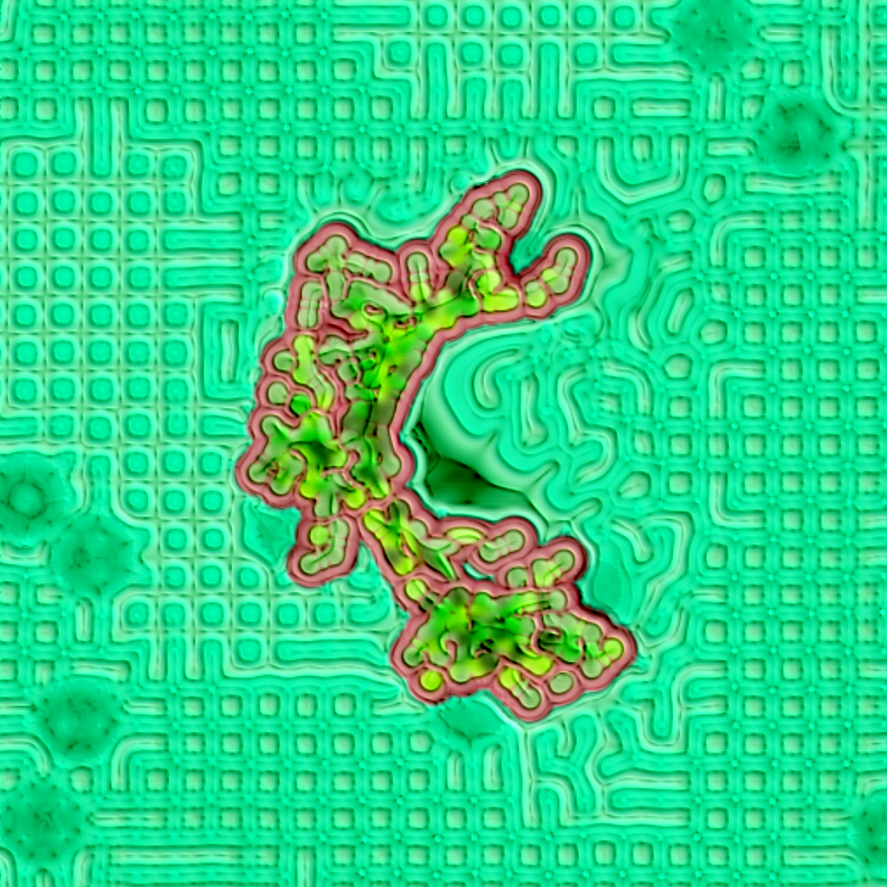

# Generation by ciphrd, fxhash

Generations is the first open-form generative art project, [released on fxhash](https://www.fxhash.xyz/project/generations).

This repository has a few set of tools I wrote to make the implementation of the project easier. It includes:

- words to bytecode compilation of seed rules (permutations, activations)
- definition of specific organisms which can be loaded in the engine for inspection
- better dev environment (notably for glsl files)

For more information on the project, [visit the fxhash page](https://www.fxhash.xyz/project/generations).
